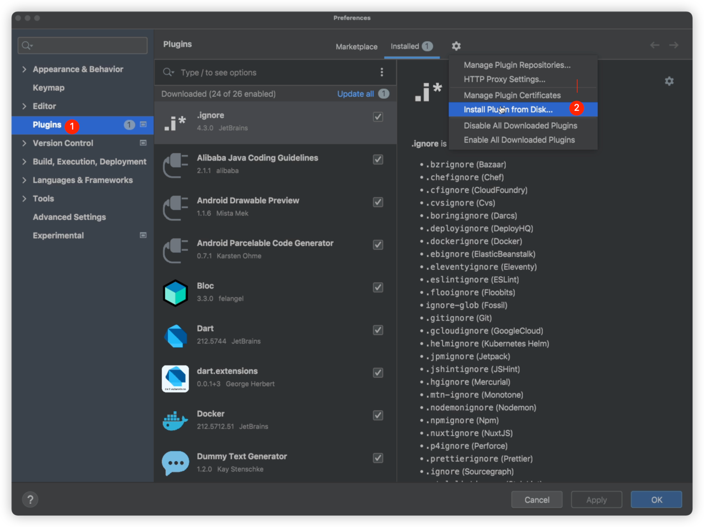
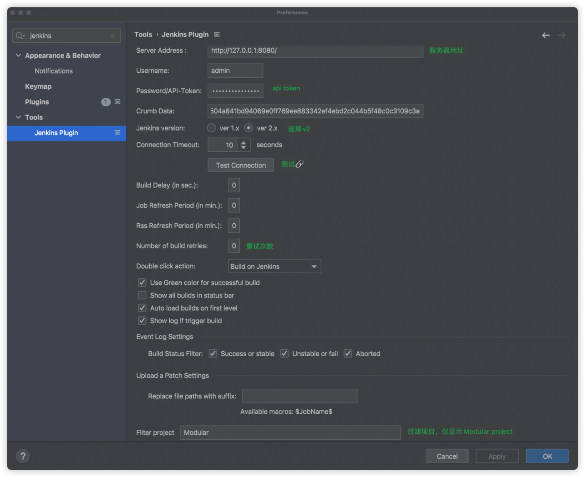
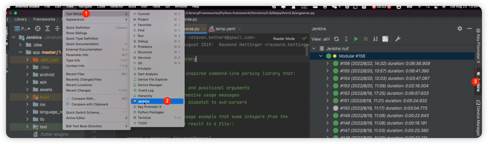
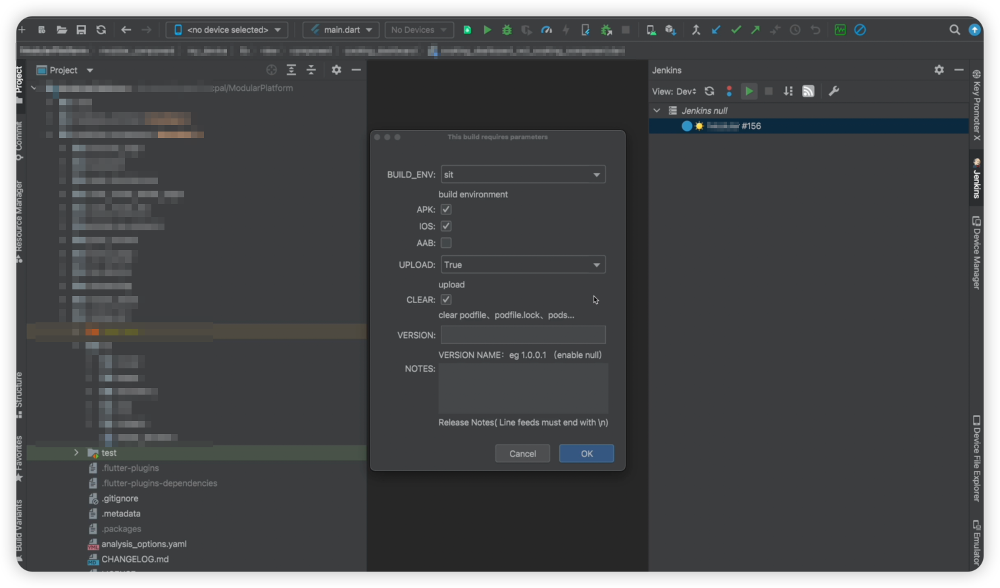

# JenkinsTools
# 插件

screen/JenkinsTools-1.0-SNAPSHOT.zip

# 安装


# 配置


```Dart
Server Address:  
UserName:  admin
API token:  xxx
Crumb Data: http://127.0.0.1:8080/crumbIssuer/api/xml?tree=crumb#
```

# 使用





